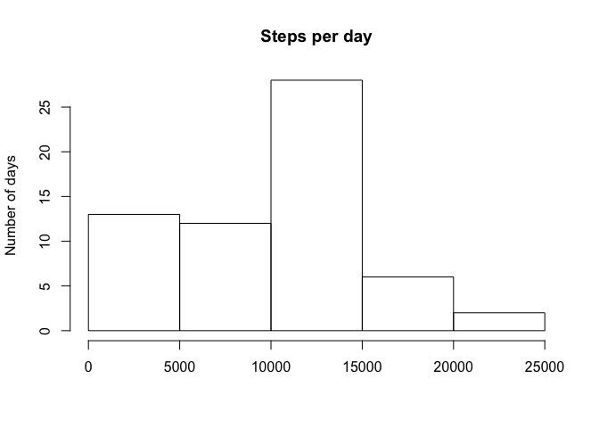
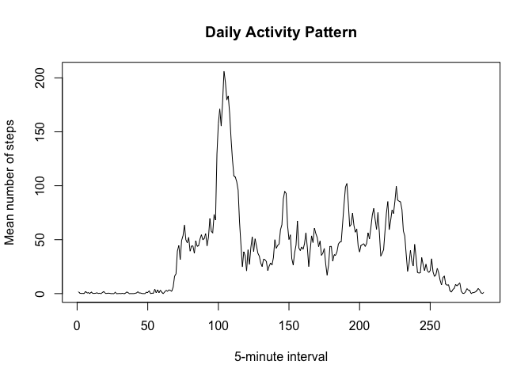
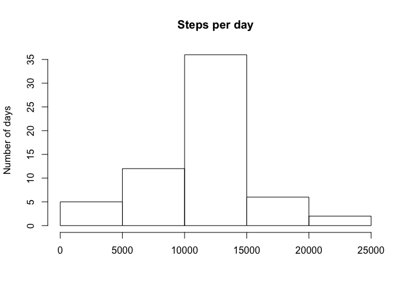
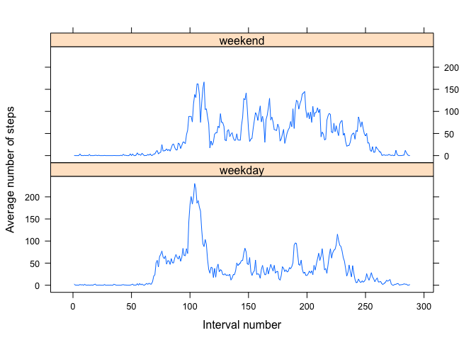

# Reproducible Research: Peer Assessment 1


## Loading and preprocessing the data

```r
unzip("activity.zip")
df <- read.csv("activity.csv")
nint <- length(unique(df$interval))
df$date <- as.Date(df$date, "%Y-%m-%d")
df$wkday <- weekdays(df$date)
file.remove("activity.csv")
```

```
## [1] TRUE
```

## What is mean total number of steps taken per day?
First we compute the total number of steps taken per day:


```r
sperday <- sapply(split(df$steps, df$date), sum, na.rm = TRUE)
```

Here is the histogram of the total number of steps taken per day:

```r
hist(sperday, main = "Steps per day", xlab = "", ylab = "Number of days")
```

 

Average number of steps per day is:


```r
mean(sperday)
```

```
## [1] 9354.23
```

Median number of steps per day is:


```r
median(sperday)
```

```
## [1] 10395
```

## Average daily activity pattern and imputing missing values

We substitute the missing values for steps my the mean values with the corresponding 5-minutes interval. We also save the mean values for the number of steps per interval into the vector *mint*.


```r
mint <- vector(mode = "numeric", length = nint)

templist <- mapply(function(x, y) {
  mint[y] <<- mean(x$steps, na.rm = TRUE)
  x$steps[is.na(x$steps)] <- mint[y]
  return(x)
  }, split(df, df$interval), 1:nint, SIMPLIFY = FALSE)

dfcomp <- do.call(rbind, templist)
rm(templist)
```

First we look at the average daily activity pattern. We convert the vector of mean steps per interval *mint* into a time series:

```r
mint <- ts(mint)
```

We plot the daily activity pattern across 5-minutes intervals


```r
plot(mint, main="Daily Activity Pattern", xlab = "5-minute interval",
     ylab = "Mean number of steps")
```

 

The interval that has the highest average activity is:

```r
paste("the interval number" ,which.max(mint), " with the average number of steps ", max(mint))
```

```
## [1] "the interval number 104  with the average number of steps  206.169811320755"
```

Which corresponds to the time

```r
unique(df$interval)[which.max(mint)]
```

```
## [1] 835
```
That is, 8:35 am - 8:40 am is on average the most active interval.


Now we look how substituting NA's with interval means have changed steps-per-day statistics.

The new histogram of the total number of steps taken per day is:

```r
sperday2 <- sapply(split(dfcomp$steps, dfcomp$date), sum, na.rm = TRUE)
hist(sperday2, main = "Steps per day", xlab = "", ylab = "Number of days")
```

 


Average number of steps per day is:


```r
mean(sperday2)
```

```
## [1] 10766.19
```

Median number of steps per day is:


```r
median(sperday2)
```

```
## [1] 10766.19
```

As it can be expected, after we added the missing values fot time intervals, the mean and median number of steps per day has increased.

## Are there differences in activity patterns between weekdays and weekends?

First, we classify the days as weekdays and weekends and calculate mean steps in each interval:


```r
weekend <- ifelse(dfcomp$wkday %in% c("Saturday", "Sunday"), "weekend", "weekday")
dlist <- split(dfcomp, weekend)
dlist <- lapply(dlist, function(x){
  sapply(split(x$steps, x$interval), mean)
})

stepweek <- unlist(dlist)
weekday <- substr(names(stepweek), 1, 7)
interval <- rep(1:288, 2)
```

Second, we plot the activity for weekends and weekdays separately:


```r
library(lattice)
xyplot(stepweek ~interval | weekday, type = "l", layout = c(1, 2), xlab = "Interval number",
      ylab = "Average number of steps")
```

 

According to the plot, activity during weekends is distributed more evenly than during weekdays.
